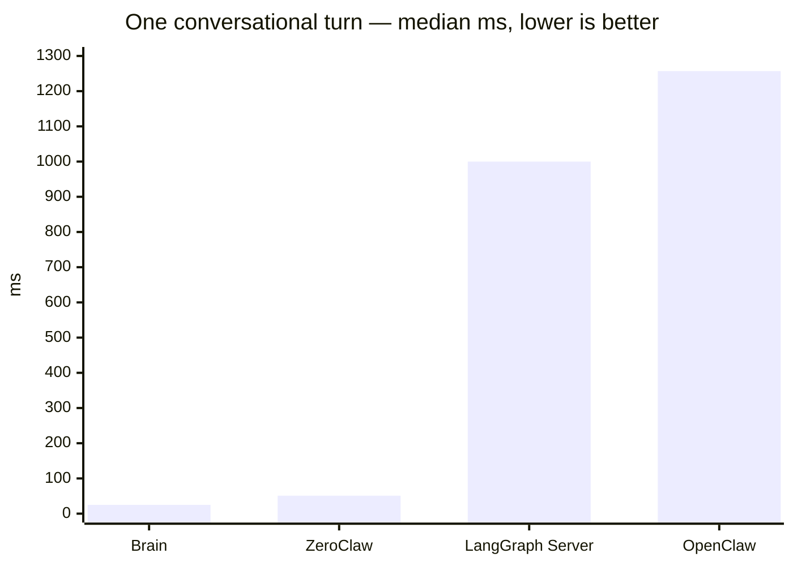
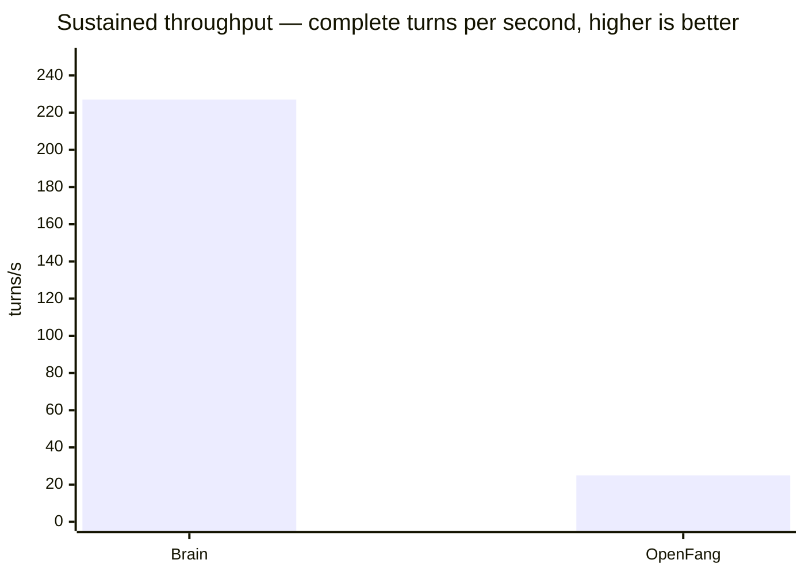
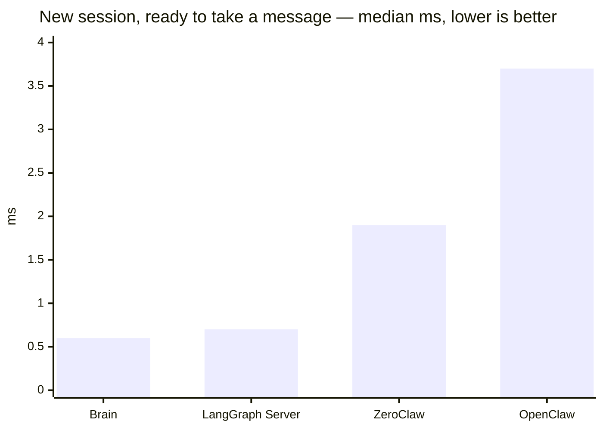
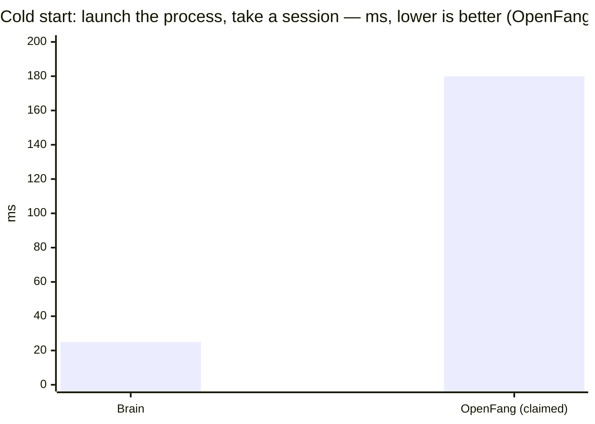
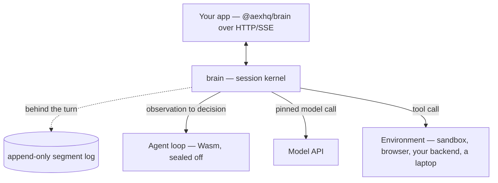

<h1 align="center">Brain</h1>

<p align="center"><strong>A tiny, blazing fast, extensible agent kernel.</strong></p>

<p align="center">
  <a href="https://github.com/aexhq/brain/actions/workflows/ci.yml"></a>
  <a href="https://www.npmjs.com/package/@aexhq/brain"></a>
  <a href="LICENSE"></a>
  
  <a href="https://discord.gg/Qk2YnHMHVb"></a>
</p>

<p align="center">
  <a href="https://aex.dev/brain/docs"><strong>Docs</strong></a> ·
  <a href="https://aex.dev/brain/docs/quickstart">Quickstart</a> ·
  <a href="https://aex.dev/brain/docs/reference/api">API Reference</a> ·
  <a href="https://aex.dev/brain">Website</a> ·
  <a href="https://github.com/aexhq/extensions">Extensions</a> ·
  <a href="https://discord.gg/Qk2YnHMHVb">Discord</a>
</p>

Brain runs agent sessions. It holds the conversation, decides what happens next, calls the model,
hands out tool calls, and appends every step to a log. That is the entire job, in about 7,300 lines
of Rust across six crates.

Four things plug into it, and all four are yours to replace: the **agent loop**, the **model**, the
**tools**, and the **environment** tools run in. Run Brain as a server your app talks to over HTTP,
or embed the `brain` crate in a Rust service you already own.

> [!NOTE]
> **Brain is under early development.** Contracts are replaced in place until the first stable
> release, and there is no upgrade path from earlier builds. APIs, package names, and wire formats
> will change without notice.

## Benchmarks

We ran Brain against thirteen other agent runtimes on the same machine, driving each one through its
own public API with the same scripted model behind it — so none of these numbers contain any real
model latency.[^bench]









| | Brain | Best of the rest |
| --- | --- | --- |
| One conversational turn | **25 ms** | 51 ms (ZeroClaw) |
| Turns per second under load | **227** | 25 (OpenFang) |
| New session, ready to take a message | **0.6 ms** | 0.7 ms (LangGraph Server) |
| Cold start: launch the process, take a session | **25 ms** | 180 ms (OpenFang, claimed) |
| Disk left by a 100-turn conversation | **0.2 MiB** | 0.2 MiB (LangGraph Server) |
| Memory at rest | **220 MiB** | 40 MiB (OpenFang, claimed) |
| Install size | **~20 MB** | 8.8 MB (ZeroClaw, claimed) |

A turn is about twice as fast as the next system and roughly forty times faster than LangGraph
Server, and Brain sustains nine times OpenFang's throughput. Starting from nothing — launching the
process and getting a session ready to take a message — takes about 25 milliseconds. What a
conversation costs on disk does not grow as it gets longer: the hundredth turn writes the same
2.3 KiB as the first. And a *session* costs almost nothing to hold open: 512 idle sessions moved the
process's private memory by about 7 MiB in total — some 14 KiB each, below what the harness can
resolve from outside the process.

Where we do less well we would rather say it. Brain sits at about 220 MiB at rest and ships as a
20 MB install, which is more than the smallest systems here on both counts. The bare runtime is
about 10 MiB private across both processes; nearly all the rest is the compiled agent loop — Brain
compiles your loop to native code inside a WebAssembly sandbox, and holding that compiled component
warm is the price of a sandboxed 25 ms turn. And a turn costs a little more as a conversation grows,
because the whole context is handed to the agent loop every time: roughly 54 microseconds per turn
of history, so a thousand-turn conversation is meaningfully slower per turn than a short one.

Two comparisons we deliberately do not make. Numbers from framework *libraries* — LangGraph, CrewAI,
AutoGen, Microsoft Agent Framework — come from a small harness we wrote around them, because they
are libraries rather than servers; they are not products measured whole, and we do not rank them
against ones that are. And hosted sandboxes are measured across the public internet, so their
figures include a network round trip that the local ones do not.

Every push also runs enforced bounds in CI against a live server: resident memory under 256 MiB
after 10,000 requests, and a session's journal held to a small constant multiple of its final
context. Figures measured before the architecture reset are archived in
[BENCHMARKS.md](BENCHMARKS.md) and are not current.

[^bench]: AWS `c7g.xlarge`, Linux, one subject at a time, each pinned away from the load generator.
    Medians over 600 samples for latency, 100 turns for disk, 16 concurrent sessions for throughput,
    512 sessions for the per-session memory probe. Every subject is driven through its own HTTP API
    against the same scripted model, and any probe a subject cannot honestly answer is recorded as a
    refusal rather than a number. Figures marked *claimed* are the other project's own published
    numbers, which carry no stated method and which we have not reproduced. The harness, with every
    subject and probe defined in its own terms, is in [`tools/bench`](tools/bench).

## How it works

Brain owns the session. Everything it does not do itself is one of four things you supply: the
agent loop (the policy — given what just happened, what next), the model binding, the tools, and
the environment tools run in.



The agent loop is sealed off: it gets an observation and returns a decision, inside a WebAssembly
sandbox with no network, no filesystem, no secrets, no clock. Brain performs every effect, which is
what makes a decision reproducible from its position in the journal — and Brain never executes tool
code, so a crashing or hostile tool takes down its own sandbox, not the process holding your
sessions. Agent loops compile to WebAssembly from any language; tools and environments talk plain
HTTP.

What makes it fast is mostly what it refuses to do on the turn's path:

- **The journal is written behind the turn.** An append is a serialise, an xxh3 over those bytes,
  and a channel send — no syscall, no fsync. Session state, the record index and idempotency live
  in memory, so a running session never reads the disk.
- **A turn records what it did, not what it holds.** The model request keeps the messages it added
  rather than the whole conversation, decisions are recorded by name rather than payload, and model
  output streams to whoever is watching instead of being written down twice.
- **Everything unbounded got a bound.** The writer queue is capped at 64 MiB with backpressure, so
  a stalled disk shows up as a slow turn rather than a process that grows until it is killed;
  idempotency records expire so they stop pinning old segments; a runaway agent loop is stopped by
  a wall-clock epoch deadline rather than instruction counting, which alone gave back 5–13% of an
  activation.
- **One of everything shared.** One HTTP client to the model provider, one buffer per journal
  frame, one encode per activation, credentials cached instead of decrypted per decision.

Sessions survive a restart, best effort: restart reads what reached the disk and rebuilds each
session from its own records. A session interrupted mid-turn comes back with a `turn_interrupted`
event — whether the model or tool call actually happened is not knowable, so Brain records exactly
that and lets the client decide.

## Quick start

Run a server:

```sh
docker run --rm -p 8080:8080 -v brain-data:/var/lib/brain ghcr.io/aexhq/brain:latest
```

Drive a session from TypeScript:

```sh
npm install @aexhq/brain @aexhq/brain-pi @aexhq/env-aws-microvm @aexhq/tools
```

```ts
import { Brain } from "@aexhq/brain";
import { awsMicroVm } from "@aexhq/env-aws-microvm";
import { pi } from "@aexhq/brain-pi";
import { bash, read, write } from "@aexhq/tools";

const brain = new Brain({ baseUrl: "http://127.0.0.1:8080" });
const workspace = awsMicroVm({ region: "eu-west-2" });

const session = await brain.sessions.create({
  model: {
    provider: "vercel-ai-gateway",
    name: "openai/gpt-5-mini",
    apiKey: process.env.VERCEL_AI_GATEWAY_API_KEY!,
  },
  brain: pi(),
  tools: [read().useIn(workspace), write().useIn(workspace), bash().useIn(workspace)],
});

await session.send("Read README.md and summarize it.");
for await (const event of session.events()) console.log(event);
```

Leave out `tools` and the model sees none. Brain listens on loopback and needs no token there; set
`BRAIN_API_TOKEN` to listen anywhere else.

Four runnable scripts — a basic session, event history, the full lifecycle, and the same thing over
raw HTTP with no SDK — are in [`examples/`](examples). Building from source and embedding the crate
in Rust are covered in the [Quickstart](https://aex.dev/brain/docs/quickstart) and the
[embedding guide](https://aex.dev/brain/docs/guides/embed). Setup, the verification commands CI
runs, and how contracts change are in [CONTRIBUTING.md](CONTRIBUTING.md) — issues and pull requests
are welcome.

## Roadmap

- [x] The four-part kernel: agent loop, model, tools, environment
- [x] Unified `brain`, `tool`, and `environment` authoring with `brain build`
- [x] Append-only segment log with restart recovery
- [x] Content identity as a type rather than a digest string
- [x] HTTP/SSE session API and the `@aexhq/brain` SDK
- [x] Remote environment contract with `env-app` and `env-aws-microvm`
- [ ] End-to-end benchmark rebuild and the cross-session isolation test
- [ ] Freeze a v1 API with tagged releases
- [ ] MCP client
- [ ] Subagents
- [ ] File access and workspace sync
- [ ] `web_search` and `web_fetch`
- [ ] crates.io publication
- [ ] Sessions spread across machines sharing environments
- [ ] `checkpoint` and `restore`
- [ ] Custom images with scoped credentials and network metering
- [ ] Hosted Brain at [aex.dev](https://aex.dev/brain)

## Acknowledgements

Brain stands on [Wasmtime](https://wasmtime.dev/) and the Bytecode Alliance's component model,
which is what lets an agent loop written in any language run sealed off and reproducible. The
benchmark would mean nothing without the projects it measures — LangGraph, ZeroClaw, OpenFang,
OpenClaw, Letta, CrewAI, AutoGen, the Microsoft Agent Framework, E2B, Firecracker, Daytona, and
Modal — and several of them shaped how Brain thinks about what a runtime owes its operator. Thanks
also to everyone filing issues and testing early builds on
[Discord](https://discord.gg/Qk2YnHMHVb).

## License

[MIT](LICENSE).
