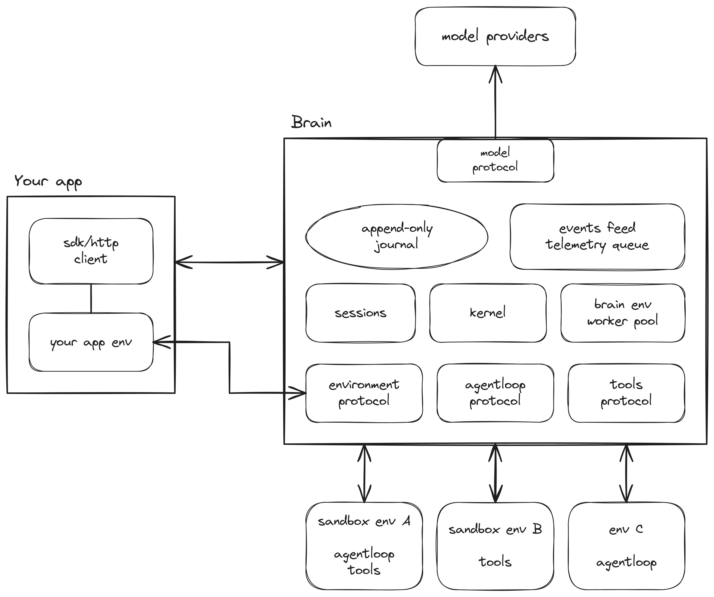

<pre align="center">
              ______ ______ _______ _______ _______
  ▄████▄     |   __ \   __ \   _   |_     _|    |  |
▄██▄██▄██▄   |   __ <      <       |_|   |_|       |
  ▀▀  ▀▀     |______/___|__|___|___|_______|__|____|
</pre>

<p align="center"><strong>A minimal, distributed and extensible agent runtime</strong></p>

<p align="center">
  <a href="https://github.com/aexhq/brain/actions/workflows/ci.yml"></a>
  <a href="https://www.npmjs.com/package/@aexhq/brain"></a>
  
</p>

<p align="center">
  <a href="https://aex.dev/brain/docs"><strong>Docs</strong></a> ·
  <a href="https://aex.dev/brain/docs/reference/api">API Reference</a> ·
  <a href="https://aex.dev/brain">Website</a> ·
  <a href="https://github.com/aexhq/extensions">Official extensions</a> ·
  <a href="ROADMAP.md">Roadmap</a> ·
  <a href="README.cn.md">中文</a>
</p>

> [!NOTE]
> **Early preview.** The API and functionality may change without backward compatibility or
> notice until we cut 1.0.0.

## What is it

**Brain** is a minimal, distributed and extensible agent runtime. You compose an Agentloop, a Model,
Tools and Environments through small public interfaces. One session can run Tools in several
Environments while its transcript and history stay locally readable.

Brain supplies runtime mechanisms. Your application supplies product policy, scheduling, tenancy and
infrastructure.

### Agentloop Extensions
The core mechanism that bridges the LLM, controls context and dispatches tools. [Write an agent loop](https://aex.dev/brain/docs/guides/write-a-loop).
- Pi
- Opencode
- Codex

### Tool Extensions
The hands that let the LLM do work. A tool declares its typed input/output and how to act. Its Environment prepares dependencies and enforces access. [Write a tool](https://aex.dev/brain/docs/guides/write-a-tool).
- Bash
- Inline function
- Web_search/Web_fetch

### Environment Extensions
An environment provides the resources a tool needs to complete its tasks. [Write an environment](https://aex.dev/brain/docs/guides/write-an-environment).
- Sandbox
- Browser
- Filesystem

### Official Extensions
Official extensions are written the same way you would write yours: [aexhq/extensions](https://github.com/aexhq/extensions).

Brain ships two Environments of its own. `brainEnv` runs Components in a fresh Wasmtime instance
per invocation, with explicitly configured Environment grants bounded by server policy. `hostEnv` is your own process, for Tools that
are plain functions. Any other Environment is reached over HTTP.

## Architecture



- **Kernel** owns the session. It commits every effect to the append-only journal before dispatch,
  sends it once and never retries on its own. Status, transcript and Events rebuild from the journal
  after a restart.
- **Sessions** owns multi-session semantics and lifecycle calls. `brain-server` composes it with
  Environment adapters and retains API credentials and request claims.
- **Brain env** runs the Agentloop and native Tools as precompiled [Wasmtime](https://wasmtime.dev/)
  Components in multiple managed worker processes. Each invocation runs in a fresh capability sandbox and calls back into Brain for model and
  tool calls, so every effect is logged before it happens.
- **One protocol** reaches every Environment: the brain env inside the server, your app registered as
  a host, and any Environment over HTTP. Callers own lifecycle policy; Environments implement setup, execution, detach and teardown.
- **Everything is observable.** Model calls, Tool results and lifecycle changes are committed Events.
  The live feed adds token deltas; reconnecting resumes at a committed sequence.

Brain is a native Rust server on [Tokio](https://tokio.rs/) and [Axum](https://github.com/tokio-rs/axum)
with HTTP and SSE. A local deployment needs no external store. The
[architecture decision records](references/adrs/README.md) explain the design and its evolution.

## Quick start

The tool below is a plain function in your own process. The SDK registers your process as a host
over SSE, so your app needs no open port.

Host functions can return ordinary output or an `Outcome` directly, preserving structured errors.
Tool deadlines yield `timeout`, explicit cancellation yields `cancelled`, and missing results after
dispatch yield `unknown`. Each is a failed Tool result; see [Tool outcomes](docs/guides/write-a-tool.mdx#return-values-and-outcomes).

Run a server:

```sh
docker run --rm -p 127.0.0.1:8080:8080 \
  -e BRAIN_LISTEN=0.0.0.0:8080 -e BRAIN_API_TOKEN=quickstart \
  -v brain-data:/var/lib/brain ghcr.io/aexhq/brain:latest
```

```sh
npm install @aexhq/brain @aexhq/agentloop-pi zod
```

Save as `order.mjs` and run with `node order.mjs`:

```js
import { Brain, brainEnv, hostEnv, tool } from "@aexhq/brain";
import { pi } from "@aexhq/agentloop-pi";
import { z } from "zod";

const orders = { "A-1001": { status: "shipped", eta: "Thursday" } };
const lookupOrder = tool({
  name: "lookup_order",
  description: "Look up an order's status by id.",
  input: z.object({ id: z.string() }),
  run: ({ id }) => orders[id] ?? { status: "unknown order" },
});

const brain = new Brain({ baseUrl: "http://127.0.0.1:8080", token: "quickstart" });
const session = await brain.sessions.create({
  model: { provider: "openai", name: "gpt-5-mini", apiKey: process.env.OPENAI_API_KEY },
  agentloop: pi({ env: brainEnv({ name: "brain" }) }),
  tools: [lookupOrder({ env: hostEnv({ name: "app" }) })],
});

await session.send("Where is order A-1001?");
for await (const event of session.events()) console.log(event.sequence, event.type);

await session.end();
await session.delete();
```

## Performance

Session execution is released after each turn and history opens on demand. Compiled Components stay
resident; each invocation gets fresh state. See [BENCHMARKS.md](BENCHMARKS.md) and
[the benchmark guide](docs/reference/benchmarks.mdx).

## Contact

For support and bug reports, open an [issue](https://github.com/aexhq/brain/issues) or write
to [support@aex.dev](mailto:support@aex.dev). For collaboration and partnerships, write to
[admin@aex.dev](mailto:admin@aex.dev).
