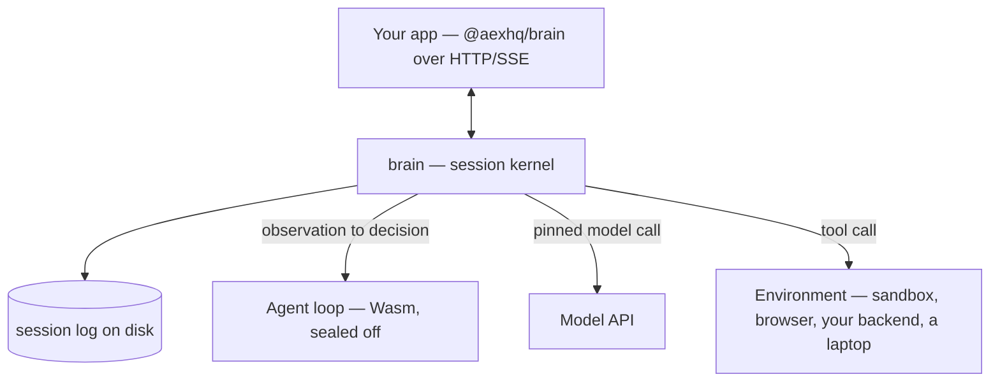

<h1 align="center">Brain</h1>

<p align="center"><strong>The durable session kernel for AI agents.</strong></p>

<p align="center">
  <a href="https://github.com/aexhq/brain/actions/workflows/ci.yml"></a>
  <a href="https://www.npmjs.com/package/@aexhq/brain"></a>
  <a href="LICENSE"></a>
  
  <a href="https://discord.gg/Qk2YnHMHVb"></a>
</p>

<p align="center">
  <a href="https://aex.dev/brain/docs"><strong>Docs</strong></a> ·
  <a href="https://aex.dev/brain/docs/quickstart">Quickstart</a> ·
  <a href="https://aex.dev/brain/docs/reference/api">API Reference</a> ·
  <a href="https://aex.dev/brain">Website</a> ·
  <a href="https://github.com/aexhq/extensions">Extensions</a> ·
  <a href="https://discord.gg/Qk2YnHMHVb">Discord</a>
</p>

Brain runs agent sessions. It holds the conversation, decides what happens next, calls the model,
hands out tool calls, and writes all of it to a durable log. That is the entire job.

Four things plug into it, and all four are yours to replace: the **agent loop**, the **model**, the
**tools**, and the **environment** tools run in. Run Brain as a server your app talks to over HTTP,
or embed the `brain` crate in a Rust service you already own.

> [!NOTE]
> **Brain is under early development.** Contracts are replaced in place until the first stable
> release, and there is no upgrade path from earlier builds. APIs, package names, and wire formats
> will change without notice.

## Quickstart

Run a server:

```sh
docker run --rm -p 8080:8080 -v brain-data:/var/lib/brain ghcr.io/aexhq/brain:latest
```

Drive a session from TypeScript:

```sh
npm install @aexhq/brain @aexhq/brain-pi @aexhq/env-aws-microvm @aexhq/tools
```

```ts
import { Brain } from "@aexhq/brain";
import { awsMicroVm } from "@aexhq/env-aws-microvm";
import { pi } from "@aexhq/brain-pi";
import { bash, read, write } from "@aexhq/tools";

const brain = new Brain({ baseUrl: "http://127.0.0.1:8080" });
const workspace = awsMicroVm({ region: "eu-west-2" });

const session = await brain.sessions.create({
  model: {
    provider: "vercel-ai-gateway",
    name: "openai/gpt-5-mini",
    apiKey: process.env.VERCEL_AI_GATEWAY_API_KEY!,
  },
  brain: pi(),
  tools: [read().useIn(workspace), write().useIn(workspace), bash().useIn(workspace)],
});

await session.send("Read README.md and summarize it.");
for await (const event of session.events()) console.log(event);
```

Leave out `tools` and the model sees none. Brain listens on loopback and needs no token there; set
`BRAIN_API_TOKEN` to listen anywhere else.

Four runnable scripts — a basic session, event history, the full lifecycle, and the same thing over
raw HTTP with no SDK — are in [`examples/`](examples). Building from source and embedding the crate
in Rust are covered in the [Quickstart](https://aex.dev/brain/docs/quickstart) and the
[embedding guide](https://aex.dev/brain/docs/guides/embed).

## How it works

Brain owns the session. Everything it does not do itself is one of four things you supply.

| Part | You supply | Brain does |
| --- | --- | --- |
| [**Agent loop**](https://aex.dev/brain/docs/concepts/agent-loop) | The policy: given what just happened, what next | Runs it in a WebAssembly sandbox and carries out the decision |
| [**Model**](https://aex.dev/brain/docs/concepts/model) | A binding: provider, model name, key | Pins it for the life of the session and makes the call |
| [**Tool**](https://aex.dev/brain/docs/concepts/tool) | A name, description, schema, and where it runs | Logs the call and sends it to the bound environment |
| [**Environment**](https://aex.dev/brain/docs/concepts/environment) | Somewhere tool calls actually execute | Sets it up, attaches, calls, cancels, tears it down |



The packages we ship use the same interface you would — nothing built in gets a shortcut.

## Why Brain

- **Sessions survive crashes.** Brain writes each step to disk before it runs. Kill the process
  mid-turn, start it again, and the session carries on from where it stopped.
- **Brain never executes tool code.** A tool call is a message to the environment you bound it to,
  so a crashing or hostile tool takes down its own sandbox, not the process holding your sessions.
- **The agent loop is sealed off.** It gets an observation and returns a decision. No network, no
  filesystem, no secrets, no clock — Brain performs every effect.
- **Any language.** Agent loops compile to WebAssembly; tools and environments talk plain HTTP. One
  tool in Rust and another in Node, in the same session.
- **Any loop, any model.** Pi, Codex-style, or your own, against Anthropic and OpenAI wire formats,
  gateways, or your own keys. The model is pinned when the session starts, so nothing swaps it out
  mid-conversation.
- **More than one machine.** Environments are addressed by a stable name, so two sessions on two
  servers can share one workspace when you want them to.
- **Everything is an event log.** A session is an ordered, replayable log of what happened. Live
  streaming sits on top and drops events rather than stalling a turn.

## Repository

| Crate / package | What it does |
| --- | --- |
| [`brain-protocol`](crates/brain-protocol) | The session, loop, model, tool, environment, event, and error contracts |
| [`brain-telemetry`](crates/brain-telemetry) | Logs, traces, metrics, and the live event stream |
| [`brain-loophost`](crates/brain-loophost) | Loads Brain Components, compiles and caches Wasm, isolates workers, enforces limits |
| [`brain`](crates/brain) | The session log, the context, the turn loop, recovery, and dispatch |
| [`brain-http`](crates/brain-http) | HTTP and SSE routing, validation, error mapping |
| [`brain-server`](crates/brain-server) | The runnable server, session lifecycle, environment adapters |
| [`@aexhq/brain`](packages/brain-sdk) | TypeScript client for any Brain URL |

The schemas and OpenAPI document under [`contracts/`](contracts) are the source of truth, and the
[API Reference](https://aex.dev/brain/docs/reference/api) is generated from them.

## Performance

The benchmark measures the engine, not a model: it drives the real HTTP and SSE paths with an
instant scripted provider and an in-process echo environment, so no model latency reaches the
numbers. CI enforces a resource bound on every push — after 10,000 requests, resident memory must
stay under 256 MiB and must not have grown by more than 16 MiB.

Latency, throughput, and the cross-session isolation test are being rebuilt against the current
kernel. Figures measured before the architecture reset are archived in
[BENCHMARKS.md](BENCHMARKS.md) and are not current.

## Status

**Shipped** — the four-part kernel; unified `brain`, `tool`, and `environment` authoring with
`brain build`; a SQLite log with crash recovery and writing to disk before acting; the HTTP/SSE
session API and the `@aexhq/brain` SDK; the remote environment contract with `env-app` and
`env-aws-microvm`.

**In progress** — splitting storage apart from sandboxing, rebuilding the benchmarks and the
cross-session isolation test, and freezing a v1 API with tagged releases.

**Next** — an MCP client, subagents, file access and workspace sync, `web_search` and `web_fetch`,
and crates.io publication.

**Later** — sessions spread across machines sharing environments, `checkpoint` and `restore`, custom
images with scoped credentials and network metering, and hosted Brain at
[aex.dev](https://aex.dev/brain).

## Contributing

Setup, the verification commands CI runs, and how contracts change are in
[CONTRIBUTING.md](CONTRIBUTING.md). Issues and pull requests are welcome — because contracts are
replaced in place before v1, a change that would be breaking later is usually just a change today.

## Acknowledgements

The name comes from Anthropic's split of
[the brain from the hands](https://www.anthropic.com/engineering/managed-agents). Brain is the
brain: it decides. Environments are the hands — a sandbox, a browser, your backend, someone's
laptop — where the work actually happens. The small-and-extensible shape follows
[Pi](https://github.com/earendil-works/pi).

## License

[MIT](LICENSE).
