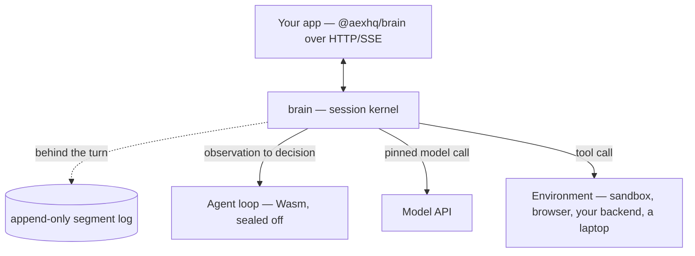

<h1 align="center">Brain</h1>

<p align="center"><strong>A tiny, blazing fast, extensible agent kernel.</strong></p>

<p align="center">
  <a href="https://github.com/aexhq/brain/actions/workflows/ci.yml"></a>
  <a href="https://www.npmjs.com/package/@aexhq/brain"></a>
  <a href="LICENSE"></a>
  
  <a href="https://discord.gg/Qk2YnHMHVb"></a>
</p>

<p align="center">
  <a href="https://aex.dev/brain/docs"><strong>Docs</strong></a> ·
  <a href="https://aex.dev/brain/docs/quickstart">Quickstart</a> ·
  <a href="https://aex.dev/brain/docs/reference/api">API Reference</a> ·
  <a href="https://aex.dev/brain">Website</a> ·
  <a href="https://github.com/aexhq/extensions">Extensions</a> ·
  <a href="https://discord.gg/Qk2YnHMHVb">Discord</a>
</p>

Brain runs agent sessions. It holds the conversation, decides what happens next, calls the model,
hands out tool calls, and appends every step to a log. That is the entire job, in about 7,300 lines
of Rust across six crates.

Four things plug into it, and all four are yours to replace: the **agent loop**, the **model**, the
**tools**, and the **environment** tools run in. Run Brain as a server your app talks to over HTTP,
or embed the `brain` crate in a Rust service you already own.

> [!NOTE]
> **Brain is under early development.** Contracts are replaced in place until the first stable
> release, and there is no upgrade path from earlier builds. APIs, package names, and wire formats
> will change without notice.

## Quickstart

Run a server:

```sh
docker run --rm -p 8080:8080 -v brain-data:/var/lib/brain ghcr.io/aexhq/brain:latest
```

Drive a session from TypeScript:

```sh
npm install @aexhq/brain @aexhq/brain-pi @aexhq/env-aws-microvm @aexhq/tools
```

```ts
import { Brain } from "@aexhq/brain";
import { awsMicroVm } from "@aexhq/env-aws-microvm";
import { pi } from "@aexhq/brain-pi";
import { bash, read, write } from "@aexhq/tools";

const brain = new Brain({ baseUrl: "http://127.0.0.1:8080" });
const workspace = awsMicroVm({ region: "eu-west-2" });

const session = await brain.sessions.create({
  model: {
    provider: "vercel-ai-gateway",
    name: "openai/gpt-5-mini",
    apiKey: process.env.VERCEL_AI_GATEWAY_API_KEY!,
  },
  brain: pi(),
  tools: [read().useIn(workspace), write().useIn(workspace), bash().useIn(workspace)],
});

await session.send("Read README.md and summarize it.");
for await (const event of session.events()) console.log(event);
```

Leave out `tools` and the model sees none. Brain listens on loopback and needs no token there; set
`BRAIN_API_TOKEN` to listen anywhere else.

Four runnable scripts — a basic session, event history, the full lifecycle, and the same thing over
raw HTTP with no SDK — are in [`examples/`](examples). Building from source and embedding the crate
in Rust are covered in the [Quickstart](https://aex.dev/brain/docs/quickstart) and the
[embedding guide](https://aex.dev/brain/docs/guides/embed).

## How it works

Brain owns the session. Everything it does not do itself is one of four things you supply.

| Part | You supply | Brain does |
| --- | --- | --- |
| [**Agent loop**](https://aex.dev/brain/docs/concepts/agent-loop) | The policy: given what just happened, what next | Runs it in a WebAssembly sandbox and carries out the decision |
| [**Model**](https://aex.dev/brain/docs/concepts/model) | A binding: provider, model name, key | Pins it for the life of the session and makes the call |
| [**Tool**](https://aex.dev/brain/docs/concepts/tool) | A name, description, schema, and where it runs | Logs the call and sends it to the bound environment |
| [**Environment**](https://aex.dev/brain/docs/concepts/environment) | Somewhere tool calls actually execute | Sets it up, attaches, calls, cancels, tears it down |



## Tiny

Six crates, about 7,600 lines of Rust. The session kernel is 3,400 of them and its journal is 1,556,
of which the entire on-disk format — frames, segment rotation, torn-tail recovery, reclamation — is
one 703-line file. There is no ORM, no query planner and no embedded database: the kernel's
dependency on SQLite was removed outright, and `sha2` went with it.

## Blazing fast

The journal is an append-only segment log written *behind* the turn. An append is a serialise, an
xxh3 over the bytes just serialised, and a channel send — no syscall on the turn's path, and no
fsync anywhere. Session state, the record index and idempotency all live in memory, so a running
session never reads the disk; paging a client's history resolves locations under the lock but reads
outside it, so replaying history never blocks an append.

What is *not* in the log matters as much. A session's state is rewritten at the end of every turn
and only its latest value is ever read, so it lives in a file per session that the writer replaces
in place — appended, it grew the journal with the square of the turn count. A recorded idempotency
answer expires, so it stops holding back the segments behind it. And the writer is bounded: past
64 MiB of frames it has not yet put on disk, an append waits, so a stalled disk shows up as a slow
turn rather than as a process that grows until it is killed.

Agentloop activations run concurrently, bounded at sixteen per worker: each one is a live Wasm
instance, so that number is the worker's memory ceiling rather than a throughput dial.

```sh
cargo test --release -p brain --test journal_throughput -- --ignored --nocapture
```

```
append 20000 x 1024 B   684168 records/s   p50 1.30 us   p99 4.60 us
page 1000 records          9.2 ms
restart replay              10 ms for 20001 records
```

One run on one machine — a 12th-gen i7-12700K, Windows 11, NVMe — where three consecutive runs held
the append rate within 1.5% and p50 at 1.30 µs. The harness reports rather than asserts, because a
threshold that passes here says nothing about your server, so run it on your own hardware. What does
not move is the shape: an append never waits on a disk, and a restart pays for the log it kept
rather than for every record ever written.

**Durability is not Brain's job.** Nothing is fsynced, so a crash can lose the log's tail. Restart
replays what reached the disk and rebuilds every session from it. Operation identifiers are derived
from `(journal_id, sequence)` and so are stable across a replay, which is the seam a layer above
Brain uses to recognise an effect it has already issued.

## Extensible

- **Nothing built in gets a shortcut.** The agent loops, models, tools and environments we ship use
  the same four interfaces yours would.
- **Brain never executes tool code.** A tool call is a message to the environment you bound it to,
  so a crashing or hostile tool takes down its own sandbox, not the process holding your sessions.
- **The agent loop is sealed off.** It gets an observation and returns a decision, inside a
  WebAssembly sandbox. No network, no filesystem, no secrets, no clock — Brain performs every
  effect, and that seal is what makes a decision reproducible from its position in the journal.
- **Any language.** Agent loops compile to WebAssembly; tools and environments talk plain HTTP. One
  tool in Rust and another in Node, in the same session.
- **Any loop, any model.** Pi, Codex-style, or your own, against Anthropic and OpenAI wire formats,
  gateways, or your own keys. The model is pinned when the session starts, so nothing swaps it out
  mid-conversation.
- **More than one machine.** Environments are addressed by a stable name, so two sessions on two
  servers can share one workspace when you want them to.
- **Everything is an event log.** A session is an ordered, replayable log of what happened. Live
  streaming sits on top and drops events rather than stalling a turn.

## Repository

| Crate / package | What it does |
| --- | --- |
| [`brain-protocol`](crates/brain-protocol) | The session, loop, model, tool, environment, event, and error contracts |
| [`brain-telemetry`](crates/brain-telemetry) | Logs, traces, metrics, and the live event stream |
| [`brain-loophost`](crates/brain-loophost) | Loads Brain Components, compiles and caches Wasm, isolates workers, enforces limits |
| [`brain`](crates/brain) | The session log, the context, the turn loop, recovery, and dispatch |
| [`brain-http`](crates/brain-http) | HTTP and SSE routing, validation, error mapping |
| [`brain-server`](crates/brain-server) | The runnable server, session lifecycle, environment adapters |
| [`@aexhq/brain`](packages/brain-sdk) | TypeScript client for any Brain URL |

The schemas and OpenAPI document under [`contracts/`](contracts) are the source of truth, and the
[API Reference](https://aex.dev/brain/docs/reference/api) is generated from them.

## What CI holds

Every push runs these against a live server, so they are bounds rather than claims:

| Bound | Enforced |
| --- | --- |
| Resident memory after 10,000 requests | under 256 MiB, and grown by no more than 16 MiB |
| A turn's journal, over 64 decisions on a 1 MiB context | no more than 8x the final context |
| A session's journal, over 64 turns on a 1 MiB context | no more than 8x the final context |
| One page of that turn's event stream | no more than 8x the final context |

End-to-end latency, throughput and the cross-session isolation test are being rebuilt against the
current kernel. Figures measured before the architecture reset are archived in
[BENCHMARKS.md](BENCHMARKS.md) and are not current — the journal numbers above come from the harness
in this repository and are reproducible with the command shown.

## Status

**Shipped** — the four-part kernel; unified `brain`, `tool`, and `environment` authoring with
`brain build`; an append-only segment log with restart recovery; content identity as a type rather
than a digest string; the HTTP/SSE session API and the `@aexhq/brain` SDK; the remote environment
contract with `env-app` and `env-aws-microvm`.

**In progress** — rebuilding the end-to-end benchmarks and the cross-session isolation test, and
freezing a v1 API with tagged releases.

**Next** — an MCP client, subagents, file access and workspace sync, `web_search` and `web_fetch`,
and crates.io publication.

**Later** — sessions spread across machines sharing environments, `checkpoint` and `restore`, custom
images with scoped credentials and network metering, and hosted Brain at
[aex.dev](https://aex.dev/brain).

## Contributing

Setup, the verification commands CI runs, and how contracts change are in
[CONTRIBUTING.md](CONTRIBUTING.md). Issues and pull requests are welcome — because contracts are
replaced in place before v1, a change that would be breaking later is usually just a change today.

## Acknowledgements

The name comes from Anthropic's split of
[the brain from the hands](https://www.anthropic.com/engineering/managed-agents). Brain is the
brain: it decides. Environments are the hands — a sandbox, a browser, your backend, someone's
laptop — where the work actually happens. The small-and-extensible shape follows
[Pi](https://github.com/earendil-works/pi).

## License

[MIT](LICENSE).
